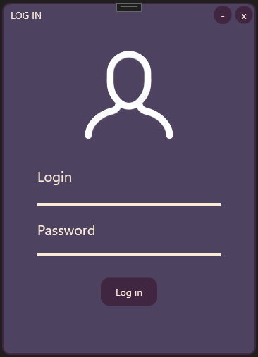

# User Login Application

## Introduction

This project is a simple application that demonstrates how to use the MVVM pattern in .NET applications to create a user login form.

## Technologies

- .NET Framework
- WPF (Windows Presentation Foundation)
- C#
- MVVM pattern